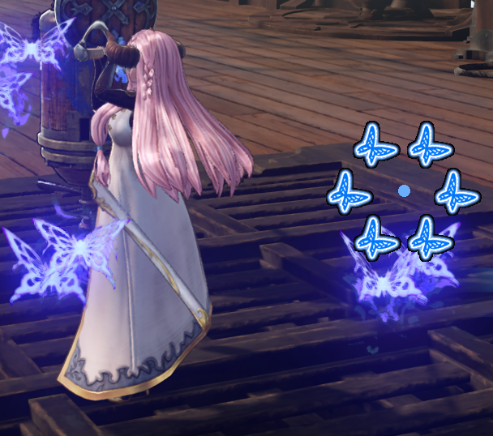

# NarmayaButterflyHud

An self-made little hud for Narmaya in Granblue Fantasy Relink

碧蓝幻想:Relink 娜露梅蝴蝶HUD

ver1

ver2

## How to run

1.Install python-3.11.6 https://www.python.org/ftp/python/3.11.6/python-3.11.6-amd64.exe

2.Clone this repo to local

3.**_Run the game first_**, then run `hudinjector.py` or `start.cmd`

## Tips:

1.LMB drag to move

2.Alt+Tab & choose the hud to close

3.PR is welcome

4.Not fully tested ~~,may cause issues when there are over 1 Namarya in party (multi-players etc)~~

## Config

1.open `config.json`

2.modify the corresponding value of 'type' to 1/2/3 to enable different ui

3.modify the corresponding value of 'size'/'radius' to change ui size

## 运行

1.安装 python-3.11.6 https://www.python.org/ftp/python/3.11.6/python-3.11.6-amd64.exe

2.克隆本 repo

3.**_保证游戏已经在运行_**,运行`hudinjector.py`或`start.cmd`

## Tips:

1.鼠标左键拖动

2.Alt+Tab 选择对应的 hud 关闭以关闭悬浮窗

3.欢迎 PR

4.~~多奶刀游戏可能数据错误(未测试)~~ 救了，希望能活

## 配置

1.打开 `config.json`

2.修改'type'对应数值为 1/2/3 以启用不同 ui

3.修改'size'/'radius'对应数值以更改 ui 尺寸

## Credit

[nyao_OuO](https://github.com/nyaoouo) for origin code and programing help
[Wrderly](https://github.com/Wrderly) for the GUI
